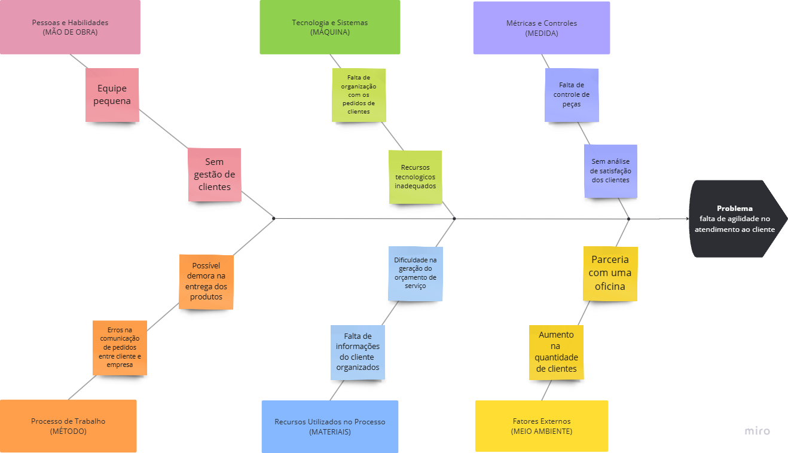

## Introdução ao Negócio e Contexto

A Pro Injeção é uma empresa do setor automotivo, especializada em serviços eletrônicos e elétricos para veículos. Desde sua fundação, a Pro Injeção dedica-se a solucionar problemas que impactam o funcionamento dos automóveis, como a programação e o reparo de módulos de injeção eletrônica (ECU), manutenção de paineis, programação de chaves e ajustes em componentes elétricos que podem impedir o funcionamento ideal do veículo.

Com foco em atender motoristas e proprietários de oficinas que buscam serviços precisos e confiáveis, a Pro Injeção oferece soluções técnicas avançadas para garantir a performance dos sistemas eletrônicos dos veículos. Sua clientela inclui tanto indivíduos que desejam aplicar melhorias ou corrigir eventuais falhas, quanto empresas de manutenção automotiva que demandam expertise em tecnologia e diagnóstico.

A missão da Pro Injeção é contribuir para a segurança e o desempenho dos veículos, trazendo inovação e confiabilidade para o mercado de serviços automotivos. Nos últimos anos, a empresa tem observado uma crescente demanda por serviços de reparo eletrônico.

## Identificação da Oportunidade ou Problema 
O principal problema identificado na Pro Injeção foi a falta de agilidade no atendimento ao cliente. Ao passo que, seu processo de atendimento depende de muitas informações e características do veículo do proprietário, como marca e modelo, ano de fabricação do veículo, entre outros, essas que não estão sendo organizadas e gerenciadas de maneira adequada. 

Dessa forma, gerando gargalos ao seu atendimento e expansão de negócio, ademais, é relevante destacar que esta empresa é composta por apenas uma pessoa o que dificulta ainda mais o atendimento.
A Figura, a seguir apresenta o diagrama de Ishikawa contendo as causas (organizados pelos 6M’s) e o problema da Pro  Injeção. 

## Desafios do Projeto

O desenvolvimento de um sistema de gestão para a Pro Injeção apresenta alguns desafios que precisam ser considerados para garantir uma solução eficaz e adequada às necessidades da empresa. Esses desafios incluem:

1. **Definição e Priorização das Funcionalidades**: É essencial identificar e priorizar as funcionalidades críticas para atender às necessidades da Pro Injeção, como a criação de orçamentos, controle de ordens de serviço e cadastro de clientes e produtos. Um desafio importante será equilibrar funcionalidades essenciais com recursos adicionais sem comprometer a simplicidade e usabilidade do sistema, assim como a abordagem utilizada pelo dono do negócio.

2. **Integração de Dados Existentes**: A Pro Injeção atualmente utiliza tabelas e planilhas para controlar suas operações. Um desafio será migrar esses dados para o novo sistema de forma organizada, garantindo que todas as informações históricas de clientes, serviços e produtos estejam acessíveis e sejam preservadas durante a transição.

3. **Facilidade de Uso para Equipes Não Técnicas**: Como o sistema será usado por pessoas com diferentes níveis de familiaridade com tecnologia, é crucial que o software seja intuitivo e de fácil utilização. Um dos desafios será desenvolver uma interface amigável que permita que todos os usuários da empresa o utilizem sem a necessidade de treinamento intensivo.

4. **Manutenção e Suporte Técnico**: A sustentabilidade do projeto dependerá da capacidade de manter e atualizar o sistema para lidar com eventuais bugs, melhorias e mudanças nas necessidades do negócio. É importante planejar para uma manutenção contínua e garantir suporte técnico, especialmente durante a fase inicial após a implementação.

5. **Garantia de Segurança e Privacidade dos Dados**: Como o sistema irá armazenar dados confidenciais dos clientes e informações financeiras, um dos principais desafios será assegurar que o sistema esteja em conformidade com as melhores práticas de segurança seguindo a LGPD, protegendo as informações contra acessos não autorizados e garantindo a privacidade dos dados.

6. **Escalabilidade para Suportar o Crescimento Futuro**: Como a empresa é nova no mercado e está em fase de crescimento, é necessário que o sistema seja escalável para suportar um número maior de clientes, ordens de serviço e produtos à medida que o negócio se expande. A arquitetura do sistema deve ser flexível e preparada para adaptações futuras sem comprometer o desempenho.

Esses desafios refletem as complexidades do projeto e destacam a importância de um planejamento cuidadoso, com foco em um desenvolvimento que seja robusto, escalável e acessível, promovendo uma transição suave para o novo sistema e maximizando seu impacto positivo para a Pro Injeção.

## Segmentação de Cliente

A Pro Injeção atende principalmente motoristas e proprietários de veículos que buscam serviços especializados em eletrônica e elétrica automotiva. A segmentação de clientes pode ser dividida nos seguintes grupos:

1. **Motoristas Individuais com Veículos Pessoais**: Esse segmento inclui proprietários de veículos que buscam serviços de manutenção e reparo para garantir a segurança e o desempenho de seus automóveis. Esse público é composto por motoristas de diferentes idades, mas geralmente entre 25 e 55 anos, que possuem veículos de uso pessoal e procuram um atendimento confiável e eficiente para resolver problemas eletrônicos e elétricos. Suas principais necessidades incluem a confiabilidade nos serviços e um custo-benefício adequado.

2. **Empresas de Manutenção Automotiva e Oficinas**: A Pro Injeção também atende oficinas e empresas do setor automotivo que precisam de suporte especializado para serviços que envolvem sistemas eletrônicos complexos. Essas empresas frequentemente terceirizam esses serviços para especialistas em eletrônica automotiva, especialmente para programação de módulos (ECU), ajustes em painéis e configuração de componentes eletrônicos. Esse segmento valoriza agilidade, precisão e qualidade nos serviços para complementar suas operações.

### **Comportamento e Necessidades dos Segmentos**

- **Confiabilidade e Transparência**: Todos os segmentos buscam uma empresa que ofereça diagnósticos precisos, orçamentos claros e um atendimento transparente sobre o que será feito e os prazos de entrega.

- **Acesso a Informações e Histórico de Serviços**: Ter acesso aos históricos de serviços é um diferencial, especialmente para empresas que precisam gerenciar várias manutenções ao longo do tempo. Esse recurso permite um acompanhamento organizado e melhora o planejamento de manutenções preventivas.

- **Simplicidade e Agilidade no Atendimento**: O público valoriza uma experiência de atendimento eficiente e simples. Sistemas que agilizem a criação de orçamentos e o controle de ordens de serviço são fundamentais para atender essa necessidade e agregar valor ao cliente.

| Versão | Descrição                 | Autor                   | Data       |
|--------|---------------------------|-------------------------|------------|
| 0.1    | Primeira ideia do projeto | [Bruno Bragança](http://github.com/BrunoBReis), [Fábio Torres](http://github.com/fabioaletorres), [Paulo Filho](http://github.com/PauloFilho2), [Pedro Braga](http://github.com/Stain19), [Vinicius Vieira](http://github.com/viniciusvieira00) | 07/11/2024 |