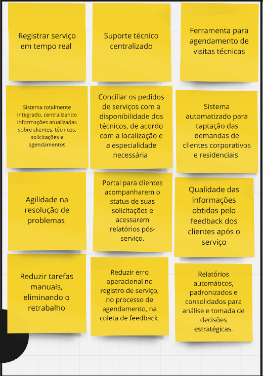
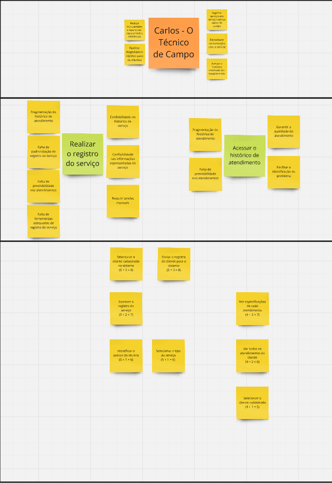
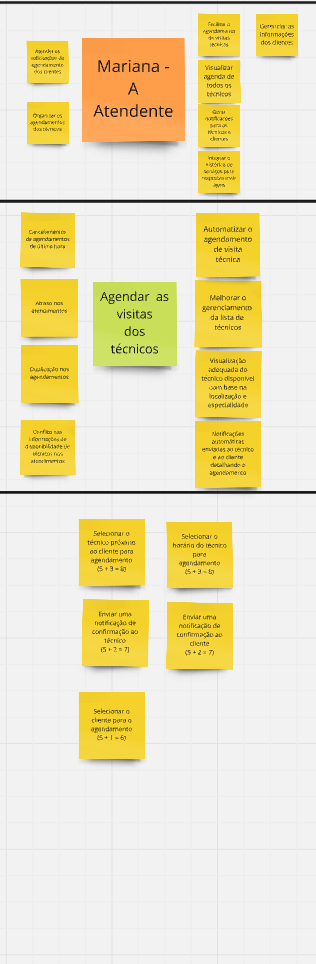
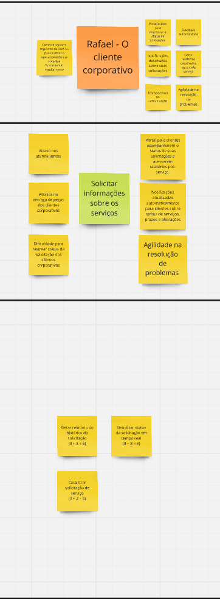
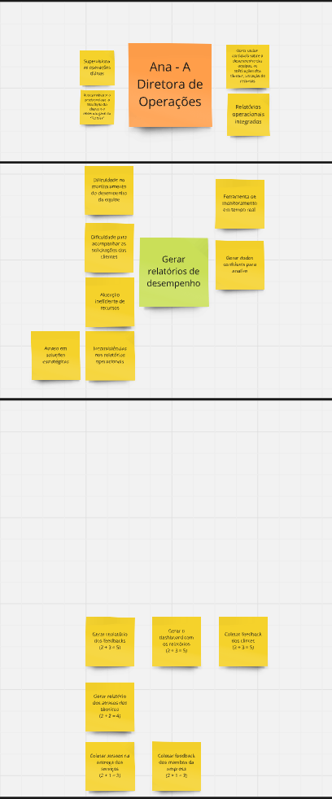

## Estudo de caso da TechFix

O material a seguir apresenta um estudo de caso da "TechFix", uma empresa de serviços de manutenção e suporte técnico para empresas e residências, enfrentando desafios significativos em sua operação. Através deste estudo de caso, vocês serão imersos em um cenário realista, onde terão a oportunidade de aplicar o método PBB para criar um backlog de produto eficaz.

### Problemas identificados


### Expectativas identificadas



### Persona: Carlos - O Técnico de campo



### Persona: Mariana - A atendente 



### Persona: Rafael - O cliente coorporativo



### Persona: Ana - A diretora de operações 




### COORG

Para priorizar os PBIs, foi utilizado a técnica de COORG, em que:

**Frequência de uso**:

- HORA A HORA (5): utilizado mais de uma vez no dia.
- DIÁRIO (4): utilizado uma vez ao dia, pelo menos.
- SEMANAL (3): utilizado uma, duas ou três vezes na semana.
- MENSAL (2): utilizado uma vez no mês ou um pouco mais de uma vez.
- TRIMESTRAL (1): utilizado, pelo menos, uma vez a cada três meses.

**Valor de negócio**:

- ALTO (3): muito importante, principal, algo com um valor de negócio alto.
- MÉDIO (2): algo que tem relevância, um valor de negócio médio.
- BAIXO (1): algo que faz sentido, mas que não agrega muito valor no
momento atual, um valor de negócio baixo.

Por fim, para a priorização foi feito 

```
frequência de uso + valor de negócio = Prioridade da US
```

### Link

Para acessar o miro basta acessar esse [link](https://miro.com/welcomeonboard/VFVZZ2hNSWpJZm0yRlJuQ2hwS0ZCRjR3UVpINEdsVUsrejdzT3gwMjlVTnpLM0c3cHZ2L0pUN2dVZmNVb1pPSzJqbE85aExlRzVHTWV5UkxnYXhoM0RTYy9qMHlCNEtzQ25PUWZsZEFIZERFNlhBUFlmdzFRK1hLdUFaT2txc0YhZQ==?share_link_id=648983736990)

## Lista de Histórias de Usuário

### Carlos - Técnico de Campo
**Feature:** Realizar o registro do serviço  

- **US1:** Como técnico de campo posso ser capaz de selecionar o cliente cadastrado para registrar o serviço.  
- **US2:** Como técnico de campo posso ser capaz de enviar o registro do cliente para o sistema.  
- **US3:** Como técnico de campo posso ser capaz de escrever o registro do serviço para manter as informações detalhadas.  
- **US4:** Como técnico de campo posso identificar meu acesso no sistema para garantir segurança e rastreabilidade.  
- **US5:** Como técnico de campo posso selecionar o tipo do serviço para registrar corretamente o atendimento.  

**Feature:** Acessar o histórico de atendimento  

- **US6:** Como técnico de campo posso ver as especificações de cada atendimento para obter detalhes sobre os serviços realizados.  
- **US7:** Como técnico de campo posso ver todos os atendimentos do cliente para ter uma visão completa do histórico.  
- **US8:** Como técnico de campo posso selecionar o cliente cadastrado para acessar o histórico de atendimentos.  


### Mariana - Atendente
**Feature:** Agendar as visitas dos técnicos  

- **US9:** Como atendente posso selecionar o técnico próximo ao cliente para agendamento para otimizar o tempo e os recursos.  
- **US10:** Como atendente posso selecionar o horário do técnico para agendamento para garantir a disponibilidade do serviço.  
- **US11:** Como atendente posso enviar uma notificação de confirmação ao técnico para informar sobre o agendamento realizado.  
- **US12:** Como atendente posso enviar uma notificação de confirmação ao cliente para garantir que ele esteja ciente do agendamento.  
- **US13:** Como atendente posso selecionar o cliente para o agendamento para associar o serviço ao cliente correto.  


### Rafael - Cliente Corporativo
**Feature:** Solicitar informações sobre os serviços  

- **US14:** Como cliente corporativo posso gerar um relatório do histórico da solicitação para acompanhar os serviços realizados.  
- **US15:** Como cliente corporativo posso visualizar o status da solicitação em tempo real para monitorar o progresso do atendimento.  
- **US16:** Como cliente corporativo posso cadastrar uma solicitação de serviço para iniciar o processo de atendimento.  


### Ana - Diretora de Operações
**Feature:** Gerar relatórios de desempenho  

- **US17:** Como diretora de operações posso gerar um relatório dos feedbacks para analisar a satisfação dos clientes.  
- **US18:** Como diretora de operações posso gerar o dashboard com os relatórios para visualizar dados de desempenho de forma consolidada.  
- **US19:** Como diretora de operações posso coletar feedback dos clientes para identificar oportunidades de melhoria.  
- **US20:** Como diretora de operações posso gerar um relatório dos atrasos dos técnicos para monitorar a eficiência das operações.  
- **US21:** Como diretora de operações posso coletar os atrasos na entrega dos serviços para identificar problemas logísticos.  
- **US22:** Como diretora de operações posso coletar feedback dos membros da empresa para melhorar os processos internos.  

## Critérios de Aceitação das Histórias de Usuário

### **US1**
**História de Usuário (Cartão):**  
Como técnico de campo posso ser capaz de selecionar o cliente cadastrado para registrar o serviço.

**Critérios de Aceitação:**  

1. O técnico consegue visualizar uma lista de clientes cadastrados no sistema.  
2. O técnico consegue pesquisar por um cliente específico utilizando filtros, como nome ou ID.  
3. O técnico não consegue selecionar um cliente que não esteja cadastrado no sistema.  
4. O técnico recebe uma mensagem de erro clara caso tente selecionar um cliente inexistente.  
5. O sistema confirma a seleção do cliente com uma notificação ou mensagem de sucesso.  


### **US2**
**História de Usuário (Cartão):**  
Como técnico de campo posso ser capaz de enviar o registro do cliente para o sistema.

**Critérios de Aceitação:**  

1. O técnico consegue enviar o registro do cliente ao sistema com todos os dados preenchidos corretamente.  
2. O sistema valida os dados antes de aceitar o envio do registro.  
3. O técnico recebe uma mensagem de erro caso os dados estejam incompletos ou inválidos.  
4. O sistema notifica o técnico quando o registro é enviado com sucesso.  
5. O envio do registro é armazenado no sistema com um registro de data e hora.  


### **US3**
**História de Usuário (Cartão):**  
Como técnico de campo posso ser capaz de escrever o registro do serviço para manter as informações detalhadas.

**Critérios de Aceitação:**  

1. O técnico consegue preencher os campos obrigatórios do registro, como descrição do serviço e status.  
2. O sistema valida que os campos obrigatórios estão preenchidos antes de permitir salvar o registro.  
3. O técnico pode editar o registro antes de enviá-lo.  
4. O sistema salva o registro de serviço com uma confirmação de sucesso.  


### **US4**
**História de Usuário (Cartão):**  
Como técnico de campo posso identificar meu acesso no sistema para garantir segurança e rastreabilidade.

**Critérios de Aceitação:**  

1. O técnico precisa fazer login no sistema com credenciais válidas para acessar o recurso.  
2. O sistema registra o acesso do técnico com data e hora.  
3. O técnico não consegue acessar o sistema com credenciais inválidas ou expiradas.  
4. O sistema exibe uma mensagem de erro clara em caso de falha de autenticação.  


### **US5**
**História de Usuário (Cartão):**  
Como técnico de campo posso selecionar o tipo do serviço para registrar corretamente o atendimento.

**Critérios de Aceitação:**  

1. O técnico consegue visualizar uma lista de tipos de serviço disponíveis no sistema.  
2. O sistema valida a seleção do tipo de serviço antes de permitir o registro.  
3. O técnico recebe uma mensagem de erro clara caso o tipo de serviço selecionado seja inválido.  
4. O sistema confirma a seleção do tipo de serviço com uma notificação de sucesso.  


### **US6**
**História de Usuário (Cartão):**  
Como técnico de campo posso ver as especificações de cada atendimento para obter detalhes sobre os serviços realizados.

**Critérios de Aceitação:**  

1. O técnico consegue visualizar uma lista de atendimentos realizados para um cliente específico.  
2. O técnico consegue acessar os detalhes de um atendimento específico, como data, descrição e status.  
3. O sistema exibe uma mensagem clara caso não haja atendimentos disponíveis para o cliente.  


### **US7**
**História de Usuário (Cartão):**  
Como técnico de campo posso ver todos os atendimentos do cliente para ter uma visão completa do histórico.

**Critérios de Aceitação:**  

1. O técnico consegue visualizar uma lista consolidada de todos os atendimentos de um cliente.  
2. O sistema permite filtrar ou ordenar os atendimentos por data, status ou tipo de serviço.  
3. O sistema exibe uma mensagem clara caso o cliente não tenha nenhum atendimento registrado.  


### **US8**
**História de Usuário (Cartão):**  
Como técnico de campo posso selecionar o cliente cadastrado para acessar o histórico de atendimentos.

**Critérios de Aceitação:**  

1. O técnico consegue visualizar uma lista de clientes cadastrados no sistema.  
2. O técnico consegue pesquisar por um cliente específico para acessar o histórico.  
3. O técnico recebe uma mensagem de erro caso selecione um cliente inexistente.  
4. O sistema confirma a seleção do cliente com uma notificação de sucesso.  


### **US9**
**História de Usuário (Cartão):**  
Como atendente posso selecionar o técnico próximo ao cliente para agendamento para otimizar o tempo e os recursos.

**Critérios de Aceitação:**  

1. A atendente consegue visualizar uma lista de técnicos disponíveis e suas localizações.  
2. O sistema sugere o técnico mais próximo do cliente com base em geolocalização.  
3. A atendente recebe uma mensagem de erro caso não haja técnicos disponíveis na região.  


### **US10**
**História de Usuário (Cartão):**  
Como atendente posso selecionar o horário do técnico para agendamento para garantir a disponibilidade do serviço.

**Critérios de Aceitação:**  

1. A atendente consegue visualizar a agenda do técnico selecionado.  
2. O sistema permite a seleção de horários disponíveis na agenda do técnico.  
3. A atendente não consegue selecionar um horário que já esteja ocupado.  
4. O sistema confirma o agendamento do horário com uma mensagem de sucesso.  


### **US11**
**História de Usuário (Cartão):**  
Como atendente posso enviar uma notificação de confirmação ao técnico para informar sobre o agendamento realizado.

**Critérios de Aceitação:**  

1. O sistema envia automaticamente uma notificação ao técnico após o agendamento ser confirmado.  
2. A notificação inclui os detalhes do cliente, data, horário e tipo de serviço.  
3. O técnico recebe a notificação em tempo real ou assim que se conectar ao sistema.  
4. A atendente recebe uma confirmação de que a notificação foi enviada com sucesso.  


## BDD - Histórias de Usuário (US1 a US6)

### **US1**
**História de Usuário (Cartão):**  
Como técnico de campo posso ser capaz de selecionar o cliente cadastrado para registrar o serviço.

**Cenário (BDD):**

1) **CENÁRIO: Seleção de cliente cadastrada disponível.**  

   - **Dado** que o técnico João está autenticado no sistema e há os clientes Carlos e Antônio cadastrados.  
   - **Quando** João selecionar o cliente Carlos na lista de clientes.  
   - **Então** o sistema deve confirmar a seleção de Carlos com uma mensagem de sucesso: "Cliente Carlos selecionado com sucesso."  

2) **CENÁRIO: Cliente não cadastrado no sistema.**  

   - **Dado** que o técnico João está autenticado no sistema e há apenas os clientes Carlos e Antônio cadastrados.  
   - **Quando** João tentar selecionar o cliente Maria, que não está cadastrado no sistema.  
   - **Então** o sistema deve exibir uma mensagem de erro: "Cliente Maria não encontrado no sistema."  

3) **CENÁRIO: Falha na conexão do sistema.**  

   - **Dado** que o técnico João está autenticado no sistema, mas o sistema está offline devido a uma falha de conexão.  
   - **Quando** João tentar acessar a lista de clientes.  
   - **Então** o sistema deve exibir uma mensagem de erro: "Não foi possível acessar a lista de clientes. Verifique sua conexão e tente novamente."  


### **US2**
**História de Usuário (Cartão):**  
Como técnico de campo posso ser capaz de enviar o registro do cliente para o sistema.

**Cenário (BDD):**

1) **CENÁRIO: Envio de registro bem-sucedido.**  

   - **Dado** que o técnico João preencheu corretamente os dados do cliente Carlos.  
   - **Quando** João enviar o registro de Carlos para o sistema.  
   - **Então** o sistema deve confirmar com a mensagem: "Registro de Carlos enviado com sucesso."  

2) **CENÁRIO: Dados incompletos no registro.**  

   - **Dado** que o técnico João deixou o campo de descrição do serviço vazio para o cliente Carlos.  
   - **Quando** João tentar enviar o registro de Carlos.  
   - **Então** o sistema deve exibir a mensagem de erro: "Dados incompletos. Preencha todos os campos obrigatórios."  

3) **CENÁRIO: Falha no envio por problemas de conexão.**  

   - **Dado** que o técnico João preencheu todos os dados do cliente Carlos, mas o sistema está offline.  
   - **Quando** João tentar enviar o registro de Carlos.  
   - **Então** o sistema deve exibir a mensagem: "Falha no envio. Verifique sua conexão e tente novamente."  


### **US3**
**História de Usuário (Cartão):**  
Como técnico de campo posso ser capaz de escrever o registro do serviço para manter as informações detalhadas.

**Cenário (BDD):**

1) **CENÁRIO: Registro do serviço preenchido corretamente.**  

   - **Dado** que o técnico João está registrando um serviço para o cliente Carlos e preencheu os campos de descrição e status.  
   - **Quando** João salvar o registro.  
   - **Então** o sistema deve confirmar com a mensagem: "Registro do serviço salvo com sucesso."  

2) **CENÁRIO: Registro com dados incompletos.**  

   - **Dado** que o técnico João deixou o campo de descrição vazio ao registrar o serviço para o cliente Carlos.  
   - **Quando** João tentar salvar o registro.  
   - **Então** o sistema deve exibir a mensagem de erro: "Erro ao salvar. Preencha todos os campos obrigatórios."  


### **US4**
**História de Usuário (Cartão):**  
Como técnico de campo posso identificar meu acesso no sistema para garantir segurança e rastreabilidade.

**Cenário (BDD):**

1) **CENÁRIO: Acesso autenticado com sucesso.**  

   - **Dado** que o técnico João tem credenciais válidas e cadastradas no sistema.  
   - **Quando** João fizer login no sistema.  
   - **Então** o sistema deve confirmar com a mensagem: "Login realizado com sucesso."  

2) **CENÁRIO: Credenciais inválidas.**  

   - **Dado** que o técnico João inseriu uma senha incorreta ao tentar fazer login.  
   - **Quando** João tentar acessar o sistema.  
   - **Então** o sistema deve exibir a mensagem de erro: "Credenciais inválidas. Tente novamente."  


### **US5**
**História de Usuário (Cartão):**  
Como técnico de campo posso selecionar o tipo do serviço para registrar corretamente o atendimento.

**Cenário (BDD):**

1) **CENÁRIO: Tipo de serviço selecionado corretamente.**  

   - **Dado** que o técnico João está registrando um serviço para o cliente Carlos e visualiza as opções "Manutenção" e "Instalação".  
   - **Quando** João selecionar "Manutenção".  
   - **Então** o sistema deve confirmar com a mensagem: "Tipo de serviço 'Manutenção' selecionado com sucesso."  

2) **CENÁRIO: Tipo de serviço inválido.**  

   - **Dado** que o técnico João inseriu manualmente um tipo de serviço não cadastrado, como "Limpeza".  
   - **Quando** João tentar salvar o registro.  
   - **Então** o sistema deve exibir a mensagem de erro: "Tipo de serviço inválido. Selecione uma opção válida."  


### **US6**
**História de Usuário (Cartão):**  
Como técnico de campo posso ver as especificações de cada atendimento para obter detalhes sobre os serviços realizados.

**Cenário (BDD):**

1) **CENÁRIO: Detalhes de atendimento disponíveis.**  

   - **Dado** que o técnico João acessou o histórico do cliente Carlos, que possui atendimentos registrados.  
   - **Quando** João selecionar um atendimento específico no histórico.  
   - **Então** o sistema deve exibir os detalhes, incluindo data, descrição e status do serviço.  

2) **CENÁRIO: Cliente sem histórico de atendimentos.**  

   - **Dado** que o técnico João acessou o histórico do cliente Antônio, que não possui atendimentos registrados.  
   - **Quando** João tentar visualizar o histórico.  
   - **Então** o sistema deve exibir a mensagem: "Nenhum atendimento encontrado para o cliente Antônio."  


