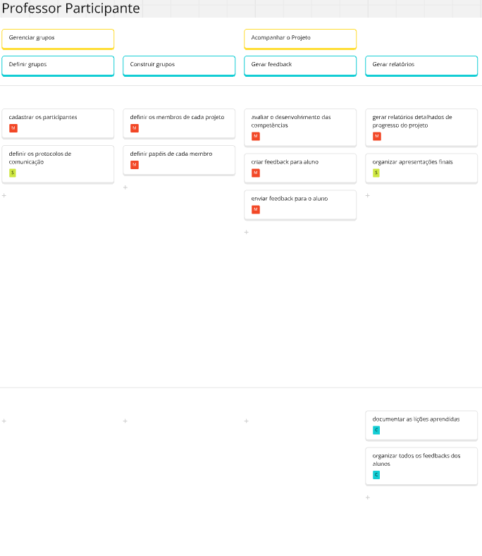
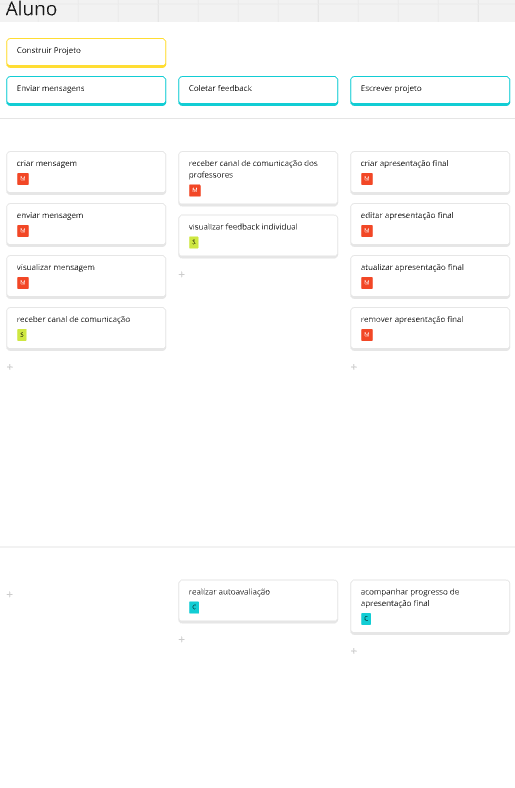
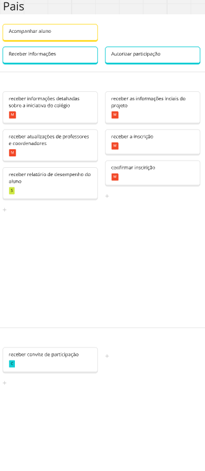
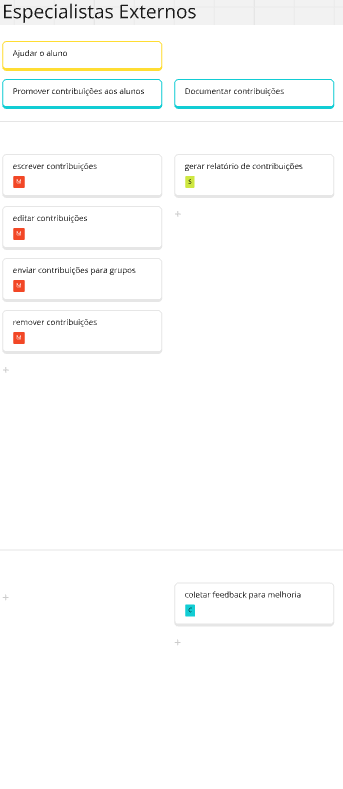
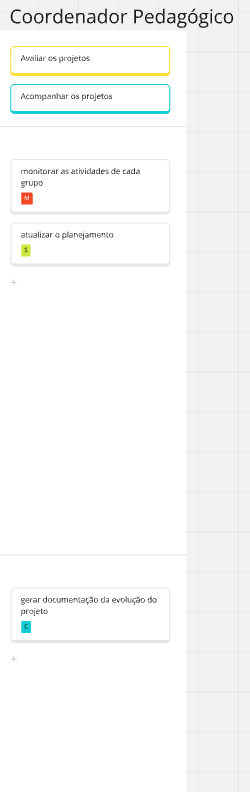

## Estudo de caso da EduConnect

A "EduConnect" é uma empresa fictícia que busca transformar a forma como instituições educacionais gerenciam projetos interdisciplinares e atividades extracurriculares. Este estudo de caso foi elaborado para proporcionar aos estudantes uma compreensão sobre os desafios e oportunidades enfrentados por uma empresa neste setor.

Para isso, foi feito o USM (User Story Mapping).

### Tabela de priorização

Foi utilizado a metodologia do MoSCoW:

- Must Have (M)
- Should Have (S)
- Could Have (C)

### Lista de requisitos não funcionais

Durante a confeção do USM foi identificado alguns requisitos não funcionais:

- Plataforma deve ter um baixo ou nenhum custo de manutenção
- Interface deve possuir poucos cliques para efeturas as ações
- Interface deve possuir estética moderna

### Persona: Professor Coordenador

### Persona: Professor Participante

### Persona: Aluno

### Persona: Pais

### Persona: Especialistas Externos

### Persona: Coordenador Pedagógico

### Link do documento

Para acessar o miro, basta entrar nesse [link](https://miro.com/welcomeonboard/VmxFSzM0bHU2MkhuOW1vQlVkbnhyd0krZGRJMEJEM0R4bWc2U01VdnMycGNBZnJZVmcwb0h1YWRnWW5COEpWOVNaUEl3V3Uwazc1WUN3cHYvbkFGbWpTYy9qMHlCNEtzQ25PUWZsZEFIZERFNlhBUFlmdzFRK1hLdUFaT2txc0YhZQ==?share_link_id=627212575653)