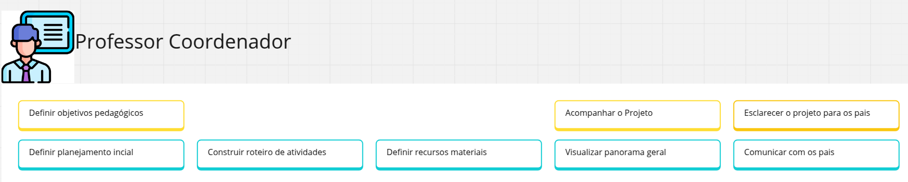
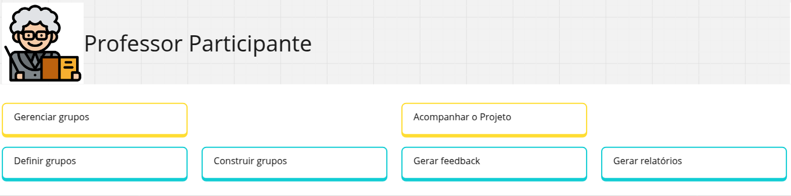
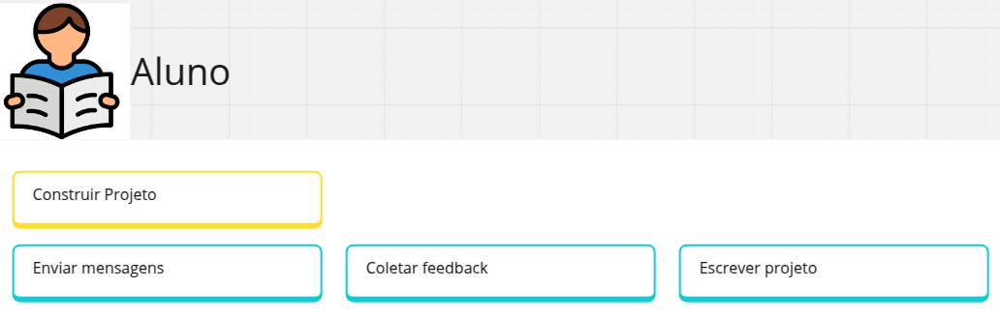
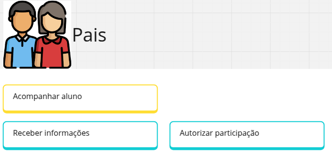
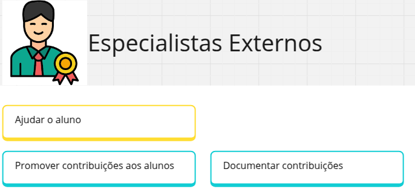
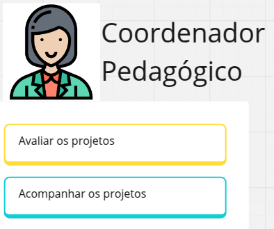

## Professor Coordenador

### Objetivos do Usuário
> O que os usuários desejam alcançar

- Definir objetivos pedagógicos
- Acompanhar o Projeto
- Esclarecer o projeto para os pais

### Jornada do usuário
> O que os usuários fazem no produto

- Definir planejamento incial
- Construir roteiro de atividades
- Definir recursos materiais
- Definir recursos humanos
- Visualizar panorama geral
- Comunicar com os pais

## Professor Participante

### Objetivos do Usuário
> O que os usuários desejam alcançar

- Gerenciar grupos 
- Acompanhar o Projeto 

### Jornada do usuário
> O que os usuários fazem no produto

- Definir grupos
- Construir grupos
- Gerar feedback
- Gerar relatórios

## Aluno

### Objetivos do Usuário
> O que os usuários desejam alcançar

- Construir Projeto

### Jornada do usuário
> O que os usuários fazem no produto

- Enviar mensagens
- Coletar feedback
- Escrever projeto

## Pais / Responsáveis

### Objetivos do Usuário
> O que os usuários desejam alcançar

- Acompanhar aluno  

### Jornada do usuário
> O que os usuários fazem no produto

- Receber informações
- Autorizar participação

## Especialistas Externos

### Objetivos do Usuário
> O que os usuários desejam alcançar

- Ajudar o aluno

### Jornada do usuário
> O que os usuários fazem no produto

- Promover contribuições aos alunos
- Documentar contribuições

## Coordenador Pedagógico

### Objetivos do Usuário
> O que os usuários desejam alcançar

- Avaliar os projetos

### Jornada do usuário
> O que os usuários fazem no produto

- Acompanhar os projetos